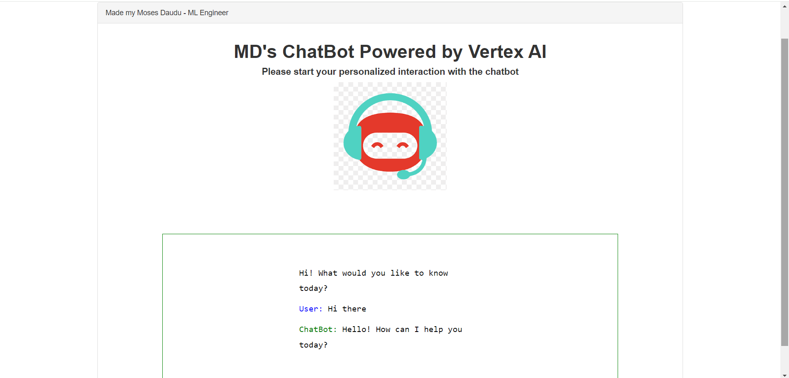
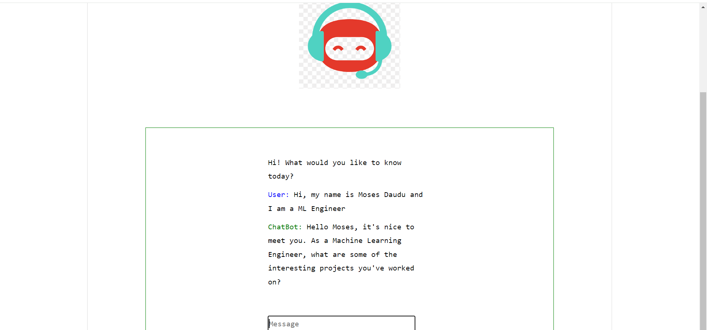

# ChatBot App

Welcome to the ChatBot app repository! This is a simple chatbot application written in Python.

## What is a ChatBot?

A ChatBot is a computer program designed to simulate conversation with human users, especially over the Internet. It can respond to user input, answer questions, and perform various tasks based on predefined rules or machine learning algorithms.

## How to Run the App

Follow the steps below to set up and run the chatbot app:

### 1. Install Requirements

Make sure you have Python installed on your system. You can download it from [python.org](https://www.python.org/).

